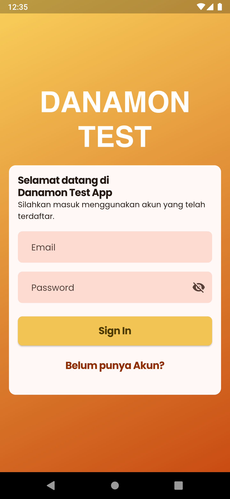
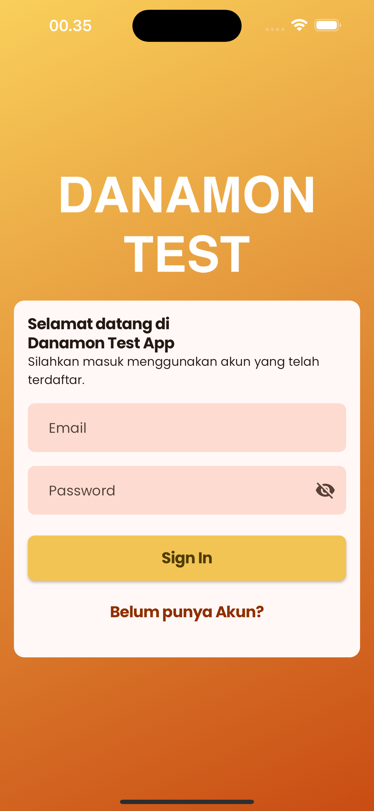
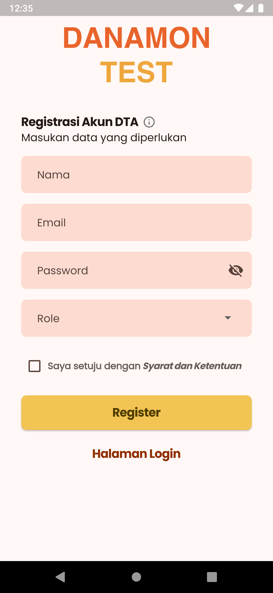
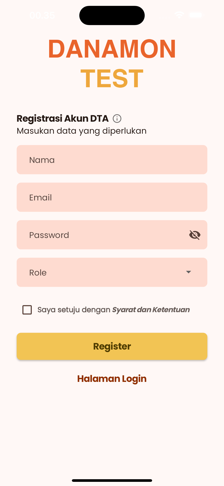
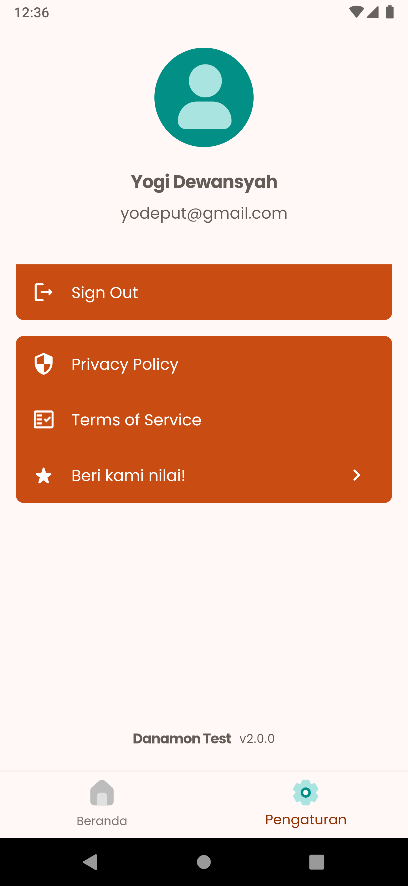
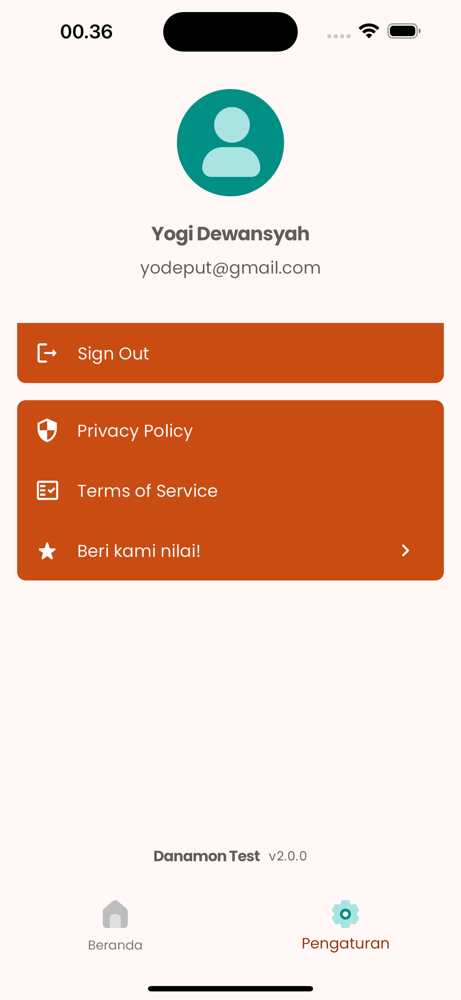
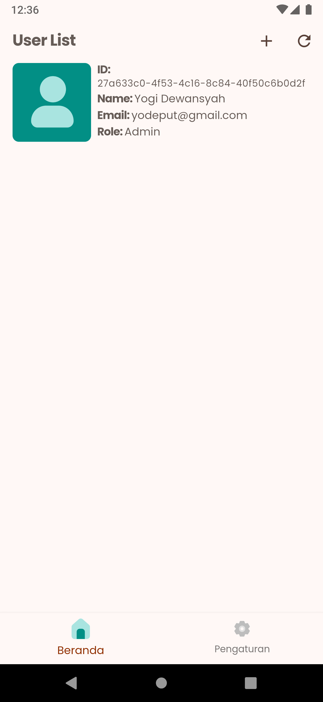
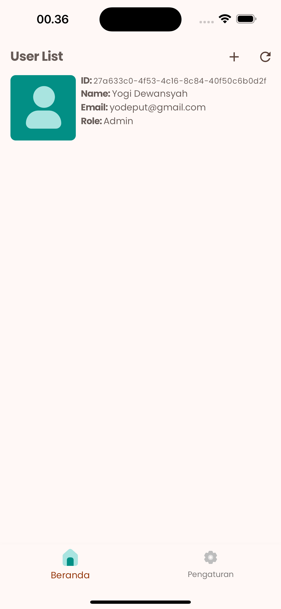
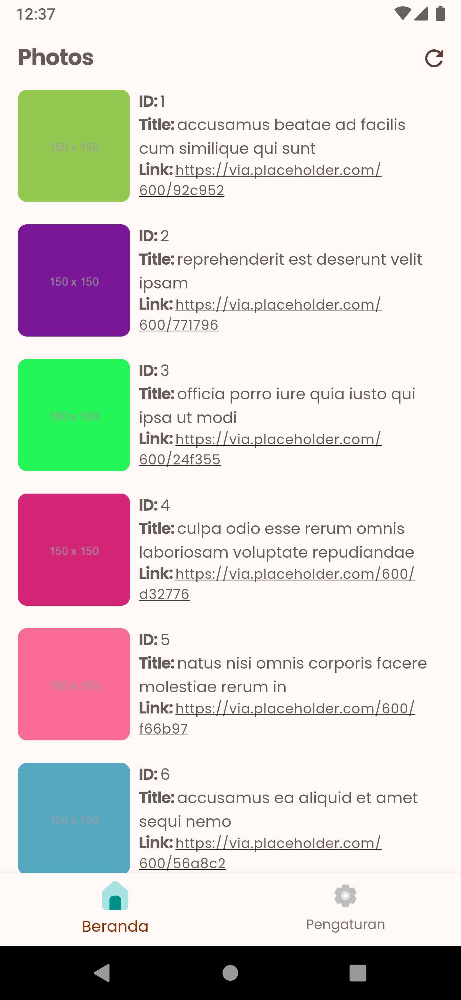
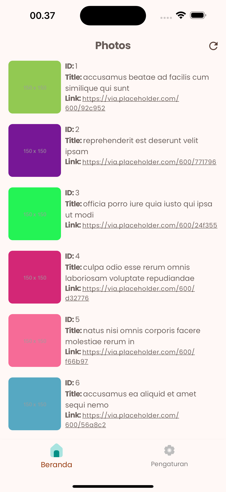

# Danamon Test App

## Table of Contents

<!-- TOC -->
- [Danamon Test App](#danamon-test-app)
  - [Table of Contents](#table-of-contents)
  - [Requirements](#requirements)
- [Getting Started](#getting-started)
  - [Running the app](#running-the-app)
  - [Environment](#environment)
- [Features](#features)
- [Docs](#docs)
  - [Code Architecture](#code-architecture)
  - [Styling](#styling)
  - [Google Fonts](#google-fonts)
  - [Screenshoots](#screenshoots)

## Requirements
- Flutter >= 3.16.7
- Cocoapods 
- fvm - Flutter version management [link](https://fvm.app/)
- derry - Script manager for Dart [link](https://pub.dev/packages/derry)

# Getting Started
## Running the app
  ```bash
  $ git clone https://github.com/yodeput/danamon-test-app.git
  $ dart pub global activate derry
  $ dart pub global activate fvm
  $ fvm install 3.19.1
  $ fvm use 3.19.1

  #to get all dependencies
  $ derry get 
  
  #to run development apk
  $ derry run_dev 
  
  #to build production apk
  $ derry build_apk_prod 
  ```
## Environment
Environment files you can find at **`assets/env/`**, after you set the env file you must run the build_runner with ***`derry build_once`*** or ***`derry watch`*** 

For VS Code just run this configurations for each platform & environment
- Android-PROD
- Android-DEV
- iPhone-PROD
- iPhone-DEV

# Features

| Feature                                                              |         | 
|----------------------------------------------------------------------|---------| 
| Platforms: Android, iOS                                              | ✅       | 
| Multi environment (dev, prod)                                        | ✅       | 
| Supabase [link](https://supabase.com)                                | ✅       | 
| State Management [flutter_bloc](https://bloclibrary.dev/)  | ✅       | 
| Dependency Injection [get_it](https://pub.dev/packages/get_it)  | ✅       | 
| Navigation using [go_router](https://pub.dev/packages/go_router)     | ✅       | 
| Material 3 Theme Colors                                              | ✅       |
| Responsive Design                                                    | ✅       |
| Profile Page                                                          | ✅       |
| Settings Page: sign out, app version...                              | ✅       |
| Legal: Terms, Policy, Data Deletion                                  | ✅       |
| Google Fonts                                                         | ✅       |
| Sign in and Sign Up Pages                                            | ✅       |
| Input Validators                                                     | ✅       |
| Cached network image                                                 | ✅       |


# Docs

## Code Architecture

The code architecture is based on
[flutter_bloc architecture proposal](https://bloclibrary.dev/#/architecture).

There are 4 layers:

1. UI (Flutter Widgets)
2. BLoC (stateful business logic)
3. Repository (high-level API)
4. Provider (low-level implementation)

And there's only 1 communication rule that we must follow:

_**The layer can only call the one layer below it.**_

That means that:

- UI can only call BLoC
- BLoC can only call Repository
- Repository can only call Provider
- Provider can only call external services (Firebase, HTTP, etc.)

And we avoid same-layer communication (as it creates interdependencies):

- `UserRepository` calling `AuthRepository` is _**not**_ allowed.
- `UserCubit` calling `UserRepository` and `AuthRepository` is allowed.

When creating Providers, Repositories, and Cubits we follow this rule:

- Providers are created top-level (so that they can be used in multiple Repositories)
- Repositories are created top-level (so that they can be used in multiple Cubits)
- Cubits are created in the router builder callbacks (so that they're accessible only where needed)
- Cubits that are used in multiple screens are created top-level

## Styling

Styling is based on [Google's Material Design](https://material.io/design).

App-wide styling is defined in `core/app/style.dart` and is easy to update.

Here's a quick tip on custom Widget params. There are 2 Widget param types:

- data (user, title, ...)
- style (colors, paddings, ...)

Our custom Widgets should only hava data params.

And the style should be done app-wide (in `style.dart`).

That way all of our UI is consistent and easy to update.

## Google Fonts

To change the font:

1. Go to [Google Fonts](https://fonts.google.com/) and select a font.
2. Download the font files.
3. Add the font files to `assets/fonts` (remove the old ones).
4. Update `style.dart` with the new font (i.e. `return GoogleFonts.poppinsTextTheme(textTheme)`).

## Screenshoots

| View | Android |   IOS   | 
|---------|---------|---------| 
| Login    |  |   |
| Register    |  |   |
| Profile    |  |   |
| User List    |  |   |
| Photo List    |  |   |